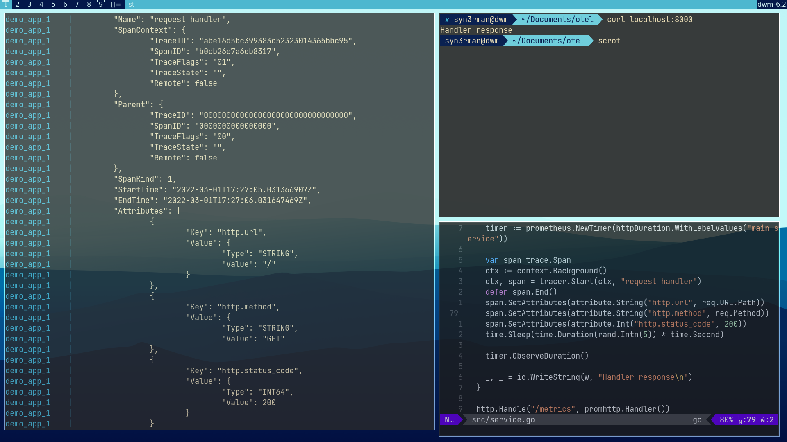
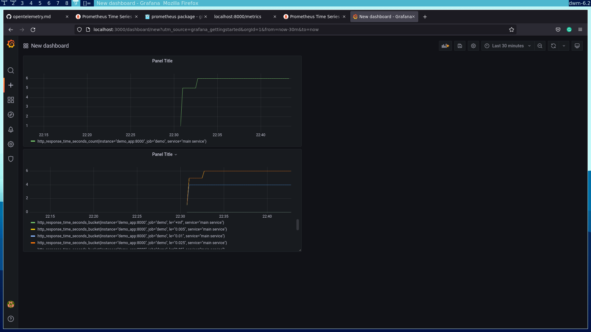

# OTel demo app

This repo contains a basic example to set up tracing in your go application using [OpenTelemetry](https://opentelemetry.io/). Additionally, we also use the [prometheus](https://pkg.go.dev/github.com/prometheus/client_golang/prometheus) client library to collect metrics from our application, which can be visualized using [Grafana](https://grafana.com/).
We can optionally create a custom build of the [OpenTelemetry Collector](https://opentelemetry.io/docs/collector/) using the prometheus receiver from the [collector contrib repo](https://github.com/open-telemetry/opentelemetry-collector-contrib) and configure a pipeline for metrics of the form 

```
receivers:
	prometheus
	
processors:
	any processor

exporters:
	any supported exporter
```

## Running the example

To run the demo, you just need to clone the repo to your machine, navigate into the directory, and run:
```
$ docker-compose up
```

Now, you can navigate to [localhost](localhost:8000) and view the trace data generated in the console. The metrics can also be viewed on the [/metrics](localhost:8000/metrics) endpoint.
A grafana instance will also be started at [port 3000](localhost:3000) with admin as username and password, so you can now login to it and add prometheus as a data source to visualize metrics.

You can also find the go application under the `src` directory, so you can choose to execute it to see the logs generated by the stdout exporter in case you do not have docker-compose installed on your system.

### Expected output:

### <u> Console output </u>

<br>


<br>

### <u> Grafana </u>
<br>

